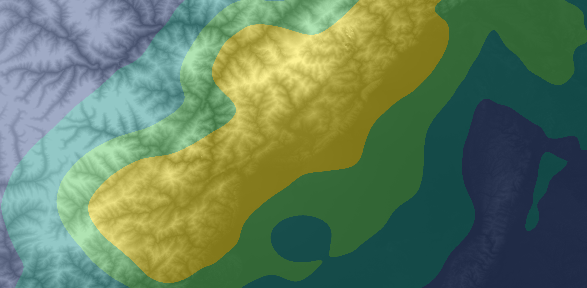
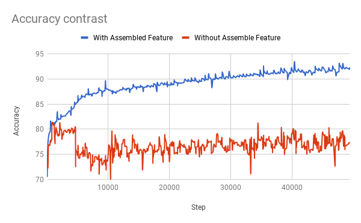
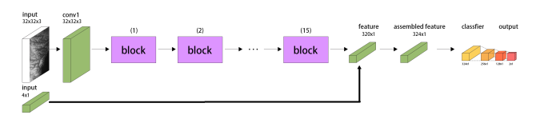
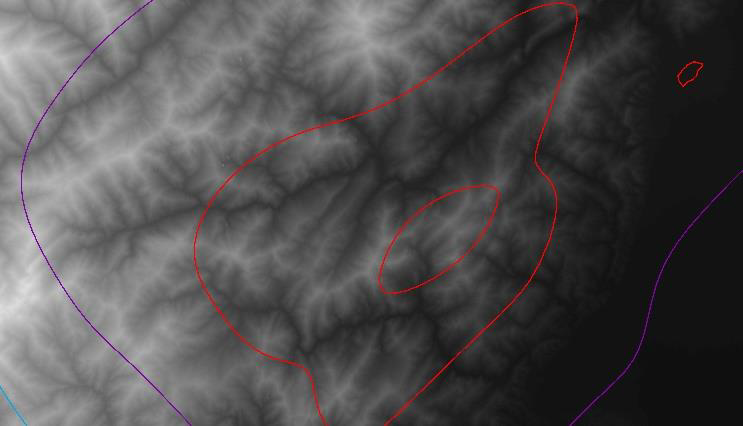
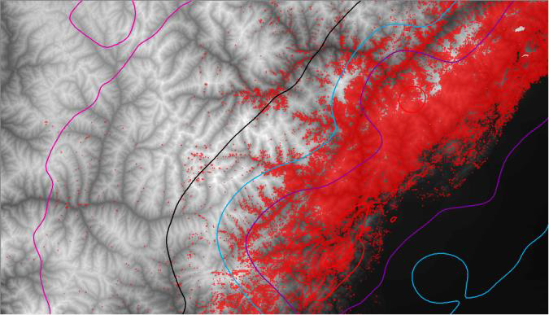
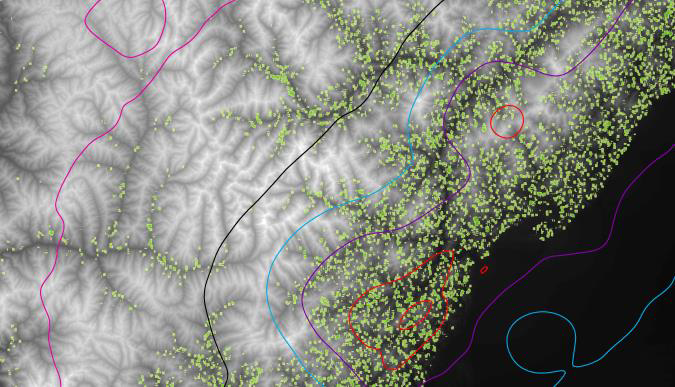
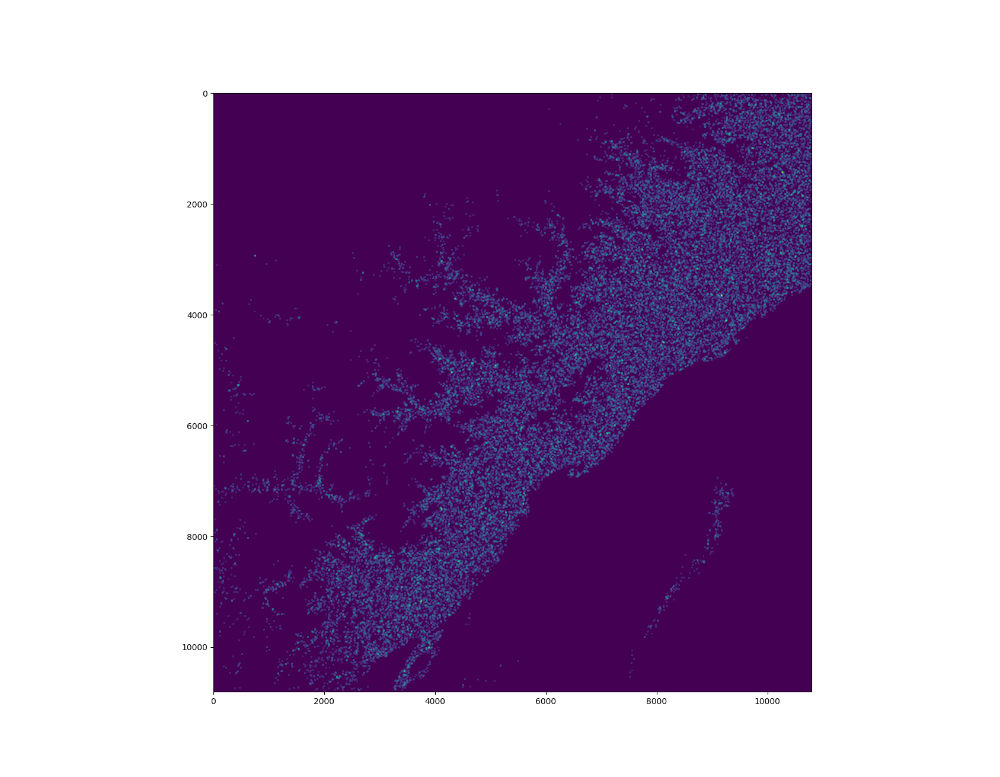
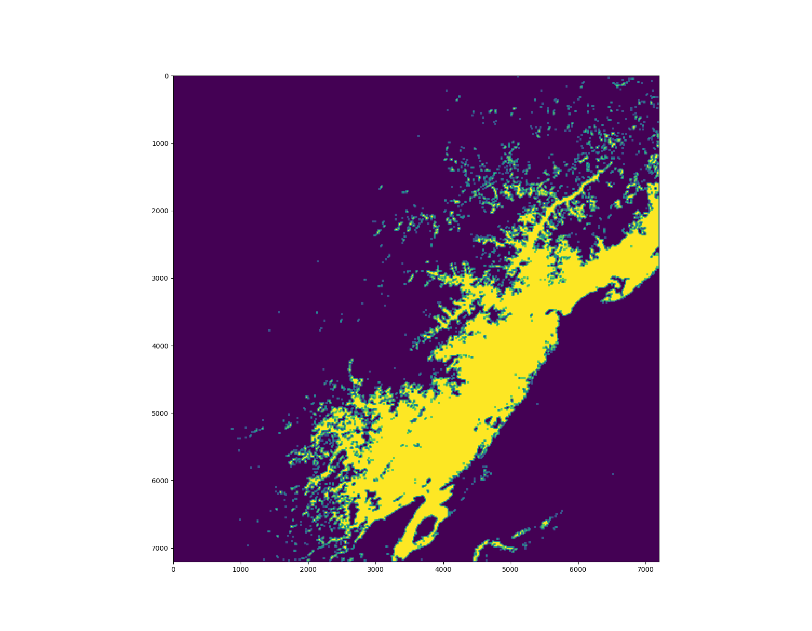

# LandSlide Prediction Algorithm

Massive earthquakes in mountainous regions often lead to numerous landslides endangering human lives. Whether and where landslides can occur is a mystery. We wonder whether it is possible to single out mountainous sites prone to landslides around major fault lines, and subsequently warn off habitation and development there. 
To do that, we propose the deep learning of terrain structure around the 2008 Wenchuan earthquake. We convert this terrain challenge to literally an MNIST challenge familiar to most data miners. Results show that landslide area can be predicted up to **~93% accuracy** when the location and depth of the quake epicenter is known, or to **~78% accuracy** with unknown epicenter location and depth. These accuracy numbers are imperfect but already useful for disaster prevention and relief work. We are releasing this dataset to the community for further experiments. In the future, deep learning of landslides from all major earthquakes around the world may lead to much more accurate predictions.

****


### Predict performance


**Without auxiliary feature vector input, the model trains to 78% binary classification accuracy. When we incorporate auxiliary feature input, the classification accuracy rises sharply to 93%.**

### Network Structure & Data Process 
We synchronized both the landslide dataset and the elevation dataset to the same ground resolution of 30 meters. Then we randomly subset both datasets to 33-by-33-pixel images. This translates to a square-kilometer region on the ground. In total we have 160,000 square kilometers in this study. 60% of the data is used for training, and 40% for validation.
We chose **EfficientNet-B0** due to its small size and excellent results.

The auxiliary input data is a **4x1 vector feature** :
* **the distance to epicenter**
* **longitudinal and latitudinal angles towards epicenter**(two cord values)
* **the local quake intensity** 
  
In Mercalli scale. We conducted two training-testing runs in total. The first training run does not incorporate the auxiliary input data feed, while the second run incorporates it. Their results will be compared and discussed in later sections.

#### The Integrated SRTM Data at epicenter, Wenchuan 2018：

* SRTM data & Fault lines


* label data in the whole Wenchuan area.

#### Predicition & Result 



The prediction visualization in the gis softwear.

#### Original prediction data

We use two different way to generate prediction data.

* Random sample
* Sliding window sample

The first way like **monte carlo simulation** that random generate a cordinate of point in the whole area and add prediction to sample position on the background zero-matrix.(see iamge below)




The second way like convolution operation.The sample process like sliding window in original STRM data map, you can set different stride to make result perfect.
(see image below)




As comparison, the first way has more information about possibility of landslide,the secound way just faster and generate binary classification result to help people make a strategic decision directly.

****

### Train & Run

##### Environment requirement：

* [Anaconda](https://www.anaconda.com/)
  [(China Option)](https://mirrors.tuna.tsinghua.edu.cn/help/anaconda/)
* [Pytorch 1.1/1.2](https://pytorch.org/)
  [(China Channel Option)](https://mirrors.tuna.tsinghua.edu.cn/anaconda/cloud/pytorch/)


**In order to simplify configuration process. you could install requirement from yml file.**


```bash
conda env create -f environment.yml
```
Then
```bash
source activate torchbeta
python predict_vector_intensity.py #train_vector_intensity.py
```
### Data:
Original Data is 

* SRTM map : [download link](http://dwtkns.com/srtm30m/)
* Intensity map : [download link](https://earthquake.usgs.gov/earthquakes/eventpage/usp000g650/shakemap/intensity)
* The Wenchuan Epicenter longitude and latitude (31.0°N,103.4°E)

Preprocessed Data :

[OneDrive Link ( China.Hongkong Data Center )](https://youngqfbr-my.sharepoint.com/:f:/g/personal/winshare_x1_tn/EjeEEp3l3qxDoJbHHVQjxDEBJpO4JwHzKjaYwoVAWHfw6Q?e=5Uez52)


[]

**Tips:**
The $10^{6}$ small files I/O has been a bottleneck in training process，append all sample data to a npy file is a greate training strategy for save you time.


It is true that our study is based on the dataset from just one major earthquake and thus can be quite limited in power. Overfitting is a serious concern. However, if geologists from quake-prone countries could share landslide cataloging data after major quakes, then it is possible to train deep learning models for the whole planet. More data leads to more reliable predictions. As a baby step, we are sharing the Wenchuan landslide dataset with the research community. 
**We invite everyone to try it and come up with insights.**
### Reference:

* [1] C. Xu et al., Three (nearly) complete inventories of landslides triggered by the May 12, 2008 Wenchuan Mw 7.9 earthquake of China and their spatial distribution statistical analysis. Landslides (2014) 11: 441
* [2] C. Xu et al., “Revisions of the M 8.0 Wenchuan earthquake seismic intensity map based on co-seismic landslide abundance”, Natural Hazards 69(3) · December 2013
* [3] Jet Propulsion Laboratory, NASA. “U.S. Releases Enhanced Shuttle Land Elevation Data”, , https://www2.jpl.nasa.gov/srtm/index.html as accessed in July 2019
* [4] M. Tan, Q. V. Le, EfficientNet: Rethinking Model Scaling for Convolutional Neural Networks, ICML2019
* [5] Y. LeCun, L. Bottou, Y. Bengio, and P. Haffner. "Gradient-based learning applied to document recognition." Proceedings of the IEEE, 86(11):2278-2324, November 1998
* [6] A. Holcombe, “Farewell authors, hello contributors”, Nature 571, 147 (2019)